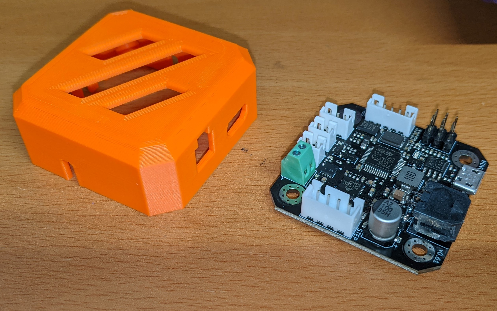

# Mount and Covers for the Huvud v61 and BTT EBB Tool Boards

## Tool Board links:

[Huvud v61](https://github.com/bondus/KlipperToolboard)

[BigTreeTech EBB-42](https://github.com/bigtreetech/EBB)

## Description

I originally bought some Huvud v61 boards, intending to install them on the back of my Voron AfterBurned/ClockWork1 extruder.

Now that StealthBurner is released, I'm instead going to use them to drive the stepper motors on my X/Y / A/B axis through CAN bus wiring.

And for that, I needed a way to mount the boards and cover them.

## Files

[CAD](CAD/)

[STL](STL/)

## Parts

Parts required:

* 1 x Base Plate
* 1 x Cover: Fan or Vented (fanless)
* 1 x 40mm x 10mm axial fan (if using the fan version)
* 4 x M3 SHCS 8mm screws for Tool Board mounting.
* 4 x M3 SHCS 12mm screws for Fan mounting (if used)
* 4 x 6mmx3mm magnets.
* Super Glue

The screws for the Tool Board mounting should be the black iron oxide, not stainless steel. Stainless is not magnetic.

## Assembly

1. Attach the Tool Board to the back of the Stepper Motor, using the Base Plate and 4 x M3 SHCS 8mm screws.
2. Attach 4 x 6x3 magnets to the standoff spots on the underside of the Cover using a drop of Super Glue. Magnet polarity doesn't matter.
3. Plug in all the wires that you need onto the Tool Board, except for the main CAN bus connector or USB cable.
4. Attach the Cover to the top of the tool board. The magnets will attach to the top of the screws.
5. Plug in the CAN bus connector or USB connector through the side of the cover.

## Pictures

## Notes

The design of the Huvud cover was based on the CAD layout and board connectors that I placed myself, and test fit with real Huvud boards.

The EBB 42 cover is based on the BigTreeTech STEP CAD model, with corrections for the board thickness (1.6mm) and added the CAN connector. I do not yet have a BTT 42 board, but the cover should fit.

If you have a stock Voron 2.4, the Vented cover version should fit without running into the top deck plate.

If you want the Fan version of the cover, you may need a Kinematic bed mount or some other method to raise the bed by 10-15mm to prevent the fan from running into the top deck plate.
